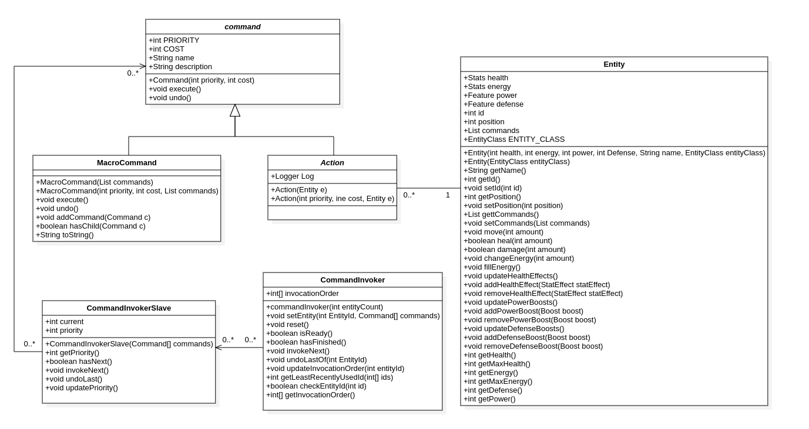
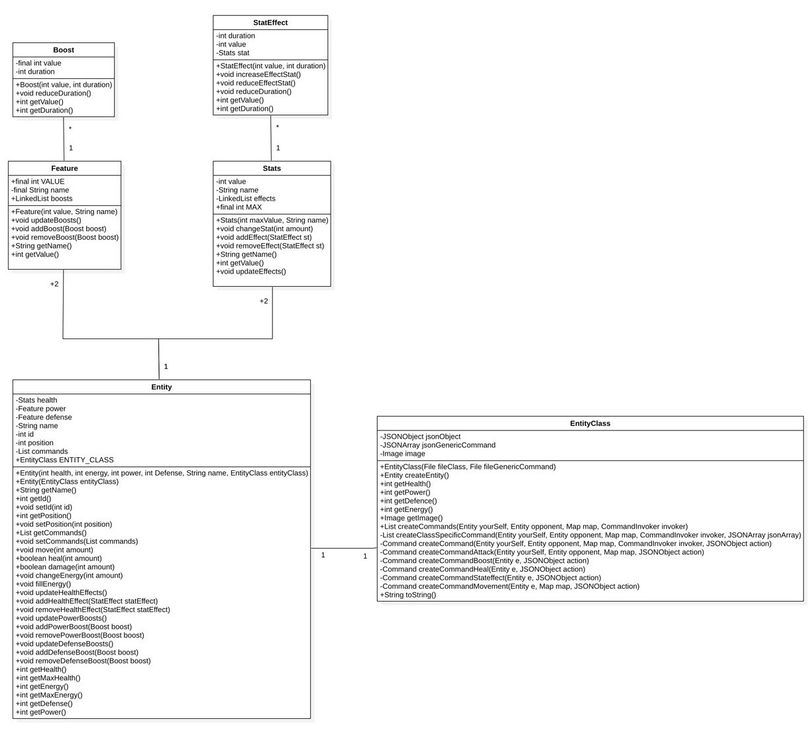

# MCR 2019 - Command Pattern

> Nohan BUDRY,  Alexandre MARQUES, Andrés MORENO, Didier PAGE, Robel TEKLEHAIMANOT

## Introduction

For the class MCR at HEIG-VD, we were given a programming pattern to implement, in our case  the pattern  was  the `Command pattern`''. In object-oriented programming, the **command pattern** is a behavioral design pattern in which an object is used to encapsulate all information needed to perform an action or trigger an event at a later time. In order to create something intresting while implementing the pattern we've decided to conceive  a combat game, "CommandAltDelete". 

## Concept

The concept of the game is a one versus one combat and strategy game, where we can choose from three different types of class characters, each one with a different set of skills. The fight takes place on a linear map composed of tiles. Once each player has decided the set of action that want to play then the simulation is generated. The game is over once a player losses all his life points. 

## Game Details 
### Map

The map is represented as a finite line of tiles.

There are two characters on the map facing each others. They can move forward or backward (always facing the opponent) and they can't walkthrough each other.

An attack will always be launched in front of the character.The damages may vary depending of the distance.

### Actions

For the actions we've  implemented  the command pattern structure. Instead of having an `Command` interface we've decided to use an abstract class enabling us to add attributes. The actions are the concrete commands, in the game we implement five main groups of concrete commands: 

- move

- attack 

- boost

- heal

- And a command to apply a status effect. 

We added the undo functionality from this pattern in order to reverse the different actions that were executed during a round as a feature inside the game that players might use.  In order to be able to create more complex actions we've also implemented the use of macro commands which is a composit of simple commands (The Macro represents, at some extent, a command that is built from the reunion of a set of other commands, in a given order). 

Each action costs energy and have a priority, so that the player needs to strategically use his points in order to achieve victory.

##### Movement

Moves a character 'x' tiles forward or backward relatively of where it's facing. Characters can't walkthrough each other.

##### Attack

Each attack has a percentage of damage and it varies according to the distance, this percentage is calculated from the entity performing the attack. There are two possible attacks, the first one  ignores the defence of the adversary and the second one considers the enemy's defence points. 

##### Heal

Heals the caster with a specific amount of health point. The character's life can't go higher than a max value.

##### Status Effect

Heals or deals damage to a characters with a fixed value (ignores defense) during a fixed period of time. Takes effect every time the character uses an action and. The remaining duration is reduced when it takes effect and the status effect is removed when the duration reaches zero.

##### Boost

Adds positive or negative bonuses to the attack and the defense stats. As for the status effect, there is a duration and the boost disapears whent it reaches zero. For attack boosts, the duration is reduced during each attack the character casts. For he defense boosts, the duration is reduced every time the character gets hit by an attack (only attacks and not status effects).

### Characters

Once the game is launched, each player must select his character. There are three possible choices: Warrior, Wizzard and the Archer class, each one with its own particular strength and virtue. 

##### Stats

- Health: Represents the number of life points. If it reaches zero, the character dies, Has a max value
- Damage: The base attack damage.
- Defense: The base defense.
- Energy: The max number of action points a player can use each turn.

##### Classes

A class is a specification for a character. Represents the fighting style of a character. Each class has a different set of actions and stats values.

###### Examples

- **Warrior**: Deals heavy damage in close combat and boosts himself.

- **Wizard **: Specializes in ranged attacks and healing.

#### Round

Each round the players can spend their energy to form a list of actions they which to play. They can't see what his opponent will use. And they can chose the order of their actions. When the lists are ready, the round simulation starts.

#### Simulation

During the simulation, actions are implemented thanks to the implementation of an invoker that chooses  which command of which entity will be executed. The order of execution is calculated  with the priorities of the actions. 

